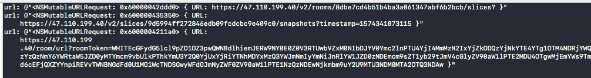

# WhiteDnsHelper

[](https://travis-ci.org/leavesster/WhiteDnsHelper)
[](https://cocoapods.org/pods/WhiteDnsHelper)
[](https://cocoapods.org/pods/WhiteDnsHelper)
[](https://cocoapods.org/pods/WhiteDnsHelper)

## Example

To run the example project, clone the repo, and run `pod install` from the Example directory first.

## Requirements

## Installation

WhiteDnsHelper is available through [CocoaPods](https://cocoapods.org). To install
it, simply add the following line to your Podfile:

```ruby
pod 'WhiteDnsHelper'
```

## How to use

```objective-c
dispatch_async(dispatch_get_global_queue(DISPATCH_QUEUE_PRIORITY_DEFAULT, 0), ^{
    //异步查询dns
    [[WhiteDnsManager shareInstance] querySdkDomain];
});

// WKWebview 拦截方式
Class cls = NSClassFromString(@"WKBrowsingContextController");
SEL sel = NSSelectorFromString(@"registerSchemeForCustomProtocol:");
if ([(id)cls respondsToSelector:sel]) {
    
#pragma clang diagnostic push
#pragma clang diagnostic ignored "-Warc-performSelector-leaks"
    // 把 http 和 https 请求交给 NSURLProtocol 处理
    [(id)cls performSelector:sel withObject:@"http"];
    [(id)cls performSelector:sel withObject:@"https"];
#pragma clang diagnostic pop

}
[NSURLProtocol registerClass:[WhiteDnsProtocol class]];
```

demo 中默认提供了一个可以测试的房间uuid 以及 roomToken，进行加入以及初始化时操作。

在 WhiteDnsProtocol.m 中的以下方法:

```Objective-c
+ (NSURLRequest *)canonicalRequestForRequest:(NSURLRequest *)request
```

在  `log message` 断点中加入 `mutableReqeust: @[mutableReqeust description]@`，即在控制台观察到类似结果：




### 注意点：

>httpdnsc 需要有降级方案，推荐在一次连接失败时，再进行主动切换。目前推荐在 `White-SDK-iOS` 加入房间/回放房间时，设置一个超时记录（目前 sdk 会无限连接），出现超时时，再尝试进行拦截。


## License

WhiteDnsHelper is available under the MIT license. See the LICENSE file for more info.
